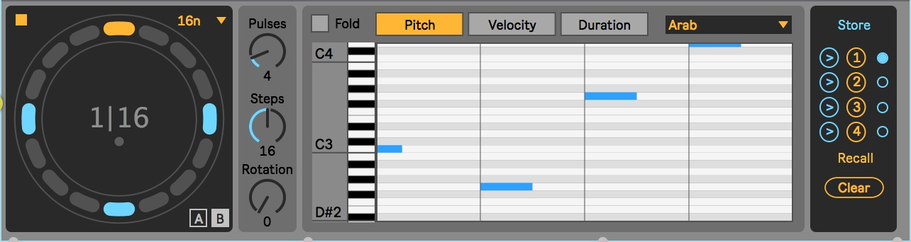

# TinyEuclid

(Very) Minimal euclidean sequencer for Max and Max4Live.
***

***

## description

TinyEuclid is not intended to provide a robust device, it was first a prototype aimed at demonstrating the use of the [vx.ui.circularstep](https://github.com/calpika/vx-ui-circularstep) view.

Based on [The Euclidean Algorithm Generates Traditional Musical Rhythms](http://cgm.cs.mcgill.ca/~godfried/publications/banff.pdf) by Godfried Toussaint (his quoted rythmic examples are available as presets in a menu).

## Files

`TinyEuclid.amxd` : the final amxd file

The `/code` folder contains : 
1. `vx.euclideanrythm.js`: javascript implementation of bjorklund algorithm and another (simpler) which produces a rotated version of the bjorklund. Other options are also available. 
2. `test_euclideanrythm.maxpat` : test patcher for the vx.euclideanrythm.js

The project has also a dependency to the [vx.ui.circularstep](https://github.com/calpika/vx-ui-circularstep) for its main *euclidean* view.

## Installation and basic usage
1. Download the `TinyEuclid.amxd` file. 
2. (optional) Drop it to your ableton live user config folder to make it accessible. 
3. Create a Live project or open an existing one. 
4. Drag and drop the device in a MIDI track. 
5. Drop an instrument after the device in order to ear a sound
6. (Tweek pitch, velocity, in the live.step view) press Play = the device should send the data to the instruments.

## Warning
This device is not production ready, with for sure some bugs... drop a line if you find annoying ones or have suggestions ! 

